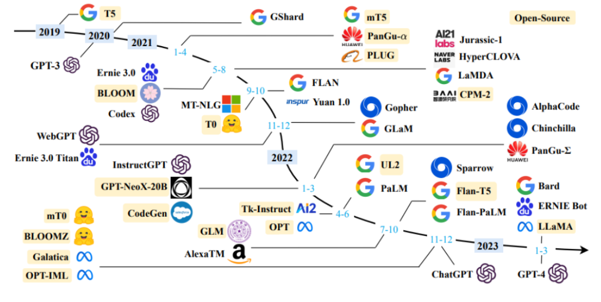
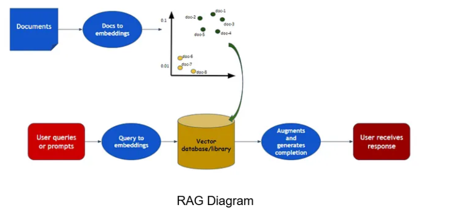

# June-2024-Group-002

Welcome to the Group 002 repository for the WaiPRACTICE June 2024 cohort. This project, developed as part of the Women in AI GenAI WAIPractice 2024 initiative, features a study tool tentatively named **Study_Pal_Geo**. This tool is designed to be an effective study aid for a specific exam.

## Contents:
1. [Premise](#pre)
2. [Our Contribution](#our)
3. [Our Conclusion/What we have Learnt](#con)
4. [Future Work](#fw)
5. [References](#ref)
6. [Contributors](#contributor)

## Team Members

Team member intro and background

### <a name="pre">1. Premise</a>

#### Summary of Project

**StudyPalGeo** is a study tool developed using a Retrieval Augmented Generation (RAG) Framework with Large Language Models (LLMs). This tool is designed to support students in their revision and exam preparation by providing reliable and level-appropriate explanations for various topics. It reduces the time spent searching for information and ensures that the generated answers are both accurate and relevant to the exam level.

#### Why We Chose the Project

The rapid advancements in Generative AI have opened up opportunities to create tools that can greatly benefit academic and everyday life. We chose this project because LLMs allow us to build a helpful tool that can save students valuable time and reduce exam-related stress by ensuring the accuracy and relevance of the information provided.

This tool is particularly useful for exams like the GCSE, where students often encounter overly complex resources during their online searches. By focusing on providing information relevant to the specific exam level, our study tool aims to be a reliable aid in students' academic journeys.

### <a name="our">2. Our Contribution</a>

We worked collaboratively to build an end-to-end RAG framework, involving the following steps:

1. **Domain Area Identification**: Focused on Education, specifically exam preparation.
2. **Data Sourcing**: Gathered official exam papers, topic booklets, and definition guides.
3. **Data Processing**: Loaded, chunked, and embedded the text into a Vector Database (FAISS).
4. **Retrieval System**: Developed a system to index and search through the document collection.
5. **LLM Integration**: Integrated an LLM (Gemma-2b) to generate contextually aware answers.

#### LLMs Used

Below is an image showcasing a variety of LLMs that were considered for the project:

    
     
    <em>Figure 1: Various LLM Options</em>

#### RAG Framework

The following diagram illustrates the RAG process used in the study tool:

    
     
    <em>Figure 2: RAG Framework Diagram</em>

### <a name="con">3. Our Conclusion/What we have Learnt</a>

Key learnings from this project include:

- **Understanding the RAG Framework**: Gained insights into how RAG frameworks enhance LLM responses.
- **GenAI Tools**: Learned about the various tools used in GenAI, including chatbots and QA systems.
- **Resource Management**: Balanced the use of cost-effective tools with the need for high-performance models.
- **Time Management**: Managed the time-intensive tasks of saving, storing, and accessing embeddings.
- **Group Collaboration**: Adopted a goal- and task-based approach to group projects.

### <a name="fw">4. Future Work</a>

Future improvements for this project include:

- **Expanding the Knowledge Database**: Integrate more subjects and exam boards beyond GCSE Geography.
- **Testing More AI Models**: Explore more powerful LLMs and storage solutions.
- **Enhancing the Tool's Flexibility**: Adapt the tool for different educational levels and systems, such as A Level/O Level exams and Irish Junior and Leaving Certificates.

### <a name="ref">5. References</a>

1. Github Repository: women-in-ai-ireland/June-2024-Group-002: WAIPractice June 2024 Group 002 (github.com)
2. [AQA GCSE Revision Guide - The Coleshill School](https://coleshill.warwickshire.sch.uk/files/2022/04/TCS-Revision-Guide.pdf)
3. Image Sources:
   - Figure 2: [Source for RAG Diagram]((https://medium.com/@akriti.upadhyay/implementing-rag-with-langchain-and-hugging-face-28e3ea66c5f7))

### <a name="contributor">6. Contributors</a>

- **Team Member 1**:
1. **Chloe Martha Cummins**
English language teacher with a passion for education and linguistics. Areas of interest include AI & Music, Ethics in NLP, Machine Translation, especially for minority languages such as Irish. Starting a MSc in Computing (Natural Language Processing) this September.

2. **Sara Garcia**
Healthcare Data analyst. Enthusiastic for Fairness and Responsible AI, specifically in the healthcare domain.  

